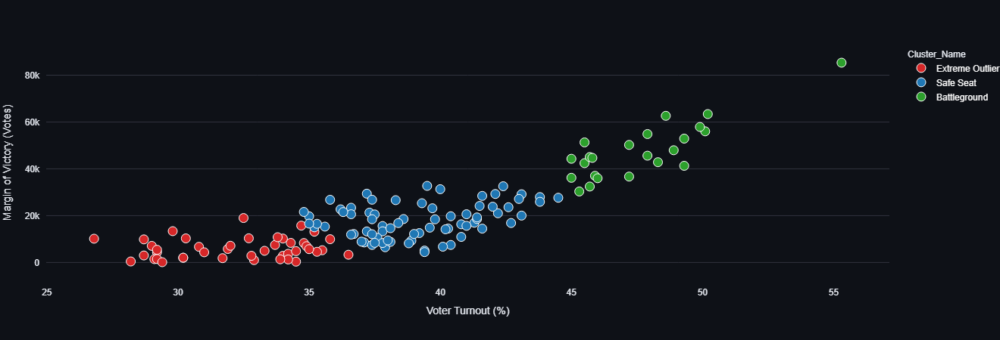

# Kerala Legislative Assembly Election 2026: Advanced Data Analytics & Predictive Profiling

## 📌 Executive Summary
This project is an end-to-end data analytics pipeline and interactive web dashboard built to analyze the official results of the 2026 Kerala Legislative Assembly Election. 

The analysis processes raw, unstructured government data (ECI Form 20) for all 140 constituencies to map regional political dominance, isolate historical vote swings, and deploy unsupervised machine learning to mathematically cluster constituencies based on voter behavior.

## 🔗 Live Application
💻 **Explore the Interactive Dashboard:** [https://kerala-election-analysis-2026-krjershan.streamlit.app/]

---

## 🛠️ Tech Stack & Architecture
* **Data Extraction & Cleaning:** Python, Pandas, NumPy
* **Machine Learning:** Scikit-Learn (K-Means Clustering, StandardScaler)
* **Interactive Visualizations:** Plotly Express
* **Web Deployment & Custom CSS UI:** Streamlit Community Cloud

---

## 🚀 Core Features & Methodology

### 1. Automated Data Pipeline
* Ingested unstructured `.xlsx` files from the Election Commission of India (ECI).
* Engineered a dynamic extraction script to bypass misaligned headers, handle missing values (`NaN`), and aggregate individual candidate rows into a clean 140-row constituency-level dataset.
* Standardized and mapped micro-parties and independent candidates (e.g., RMPOI, RJD, KEC) into their respective major alliances (**UDF**, **LDF**, **NDA**).

### 2. Machine Learning: Constituency Profiling
* Implemented a **K-Means Clustering** algorithm to segment the 140 constituencies into three distinct profiles without introducing human bias.
* Utilized `StandardScaler` to handle magnitude variances between voter percentages and absolute numeric margins.
* Segmented profiles include:
  * 🟢 **Battlegrounds:** High turnout, razor-thin margins.
  * 🔵 **Safe Seats:** Average turnout, comfortable margins.
  * 🔴 **Extreme Outliers:** Wave-election strongholds.

### 3. Historical Swing Analysis
* Combined the 2026 election dataset with historical 2021 baseline data.
* Programmatically isolated and visualized the **Top 20 Most Extreme Election Swings** using a custom-built, diverging horizontal distribution tracking positive gains vs. negative margin contractions.

---

## 📊 Analytics & Machine Learning Previews

### K-Means Clustering Profiling Output
*Below is a static snapshot of how the unsupervised algorithm clustered the constituencies based on Voter Turnout vs. Victory Margin. Interact with the live tooltips via the Streamlit web application link above.*

<!-- Replace the placeholder path below with your uploaded image filename -->

---

## 💻 How to View the Project

### Part 1: The Core Pipeline (Jupyter / Colab)
The step-by-step exploratory data analysis, data cleaning logic, and mathematical implementations are documented inside the `Kerala_Election_2026_Analysis.ipynb` notebook.

### Part 2: Live Production Dashboard
The web application is fully deployed and rendered using customized Streamlit UI metric cards styled specifically to match the unique colors of the political alliances. 

---
**Developed by KR Jershan**
